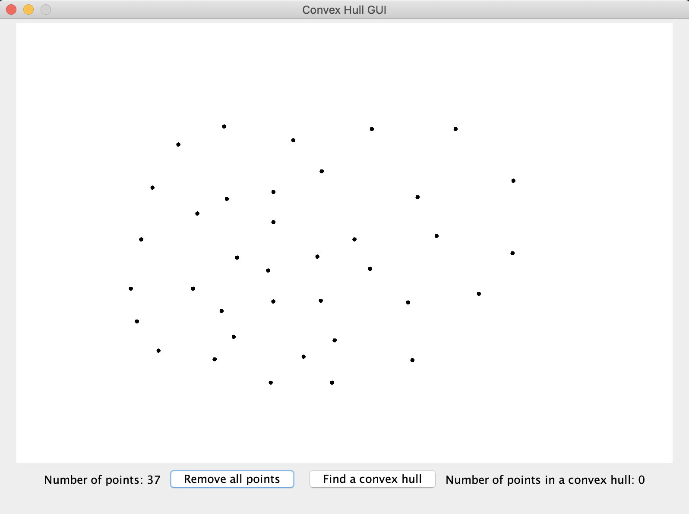

# ConvexHullGUI
Finding a convex hull with Graham scan. Program was developed in Java.  
User can create points in a window. After that user can  
press a "Find a convex hull" button and the algorithm will start.  
Or user can clear the area.  

# Demonstration
  

# How to run a program
Download .jar file "ConvexHullGUI.jar". 
Move to the directory with this .jar file.  
Run this command in a console:  
java -jar ConvexHullGUI.jar  
(Make sure to install Java Runtime Environment)
